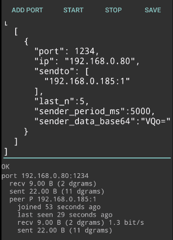
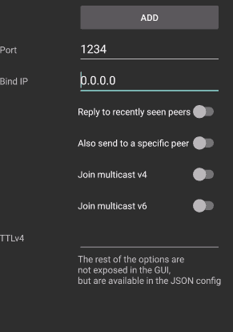

# android-udp-bus

Android application to create UDP forwarders, hubs and other tools. To aid building VPNs, video streaming and other tricky network uses.

 

Build it using `./gradlew cargoBuild && ./gradlew assembleDebug` or just download apk from [Github Releases](https://github.com/vi/android-udp-bus/releases/).

# Features

* Binding UDP socket on specified port and exchanging traffic between all known peers
* Exchanging traffic between multiple UDP sockets
* Remembering specified number of peers that have sent us some datagram, with optional expiration policy
* Directly specifying peers to send datagrams to. Combined with remembering, it allows using the application as UDP forwarder.
* Joining multicast groups, setting TTL, TOS, read and write buffer sizes and other socket options.
* Periodical sending of hardcoded datagrams to specified peers (e.g. to keep NAT open)
* Displaying of detailed statistics of the traffic
* Starting multiple isolated hubs, each with distinct set of ports. Can even act as a simplistic load balancer due to `SO_REUSEPORT`.

The application does not send datagrams back to sender.

# Limitation

* UI is not user-friendly.
* Not all features are exposed in GUI - you may want to add some undocumented fields to the JSON manually.
* Not very optimised for speed or latency. It may be slightly slower than `socat udp4-l udp`.
* Not everything is tested yet
* Documentation is lacking
